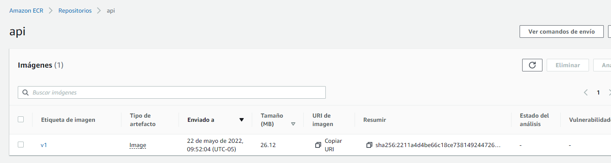
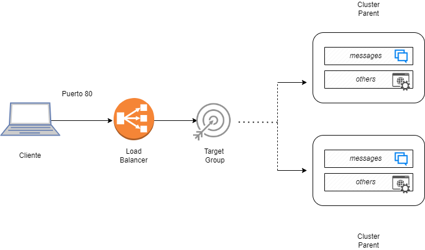
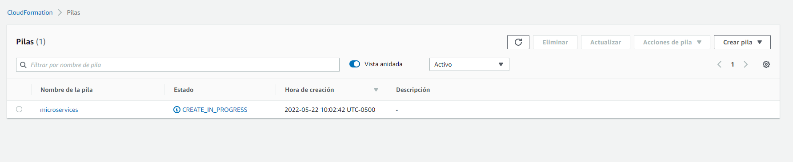
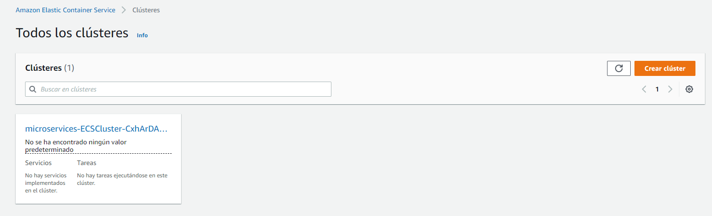
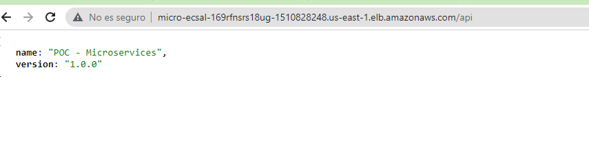
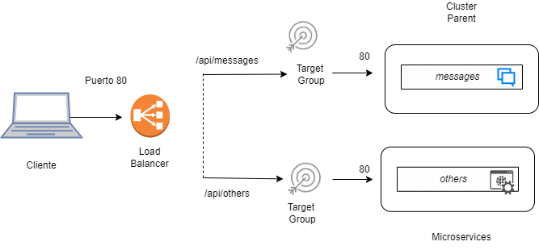
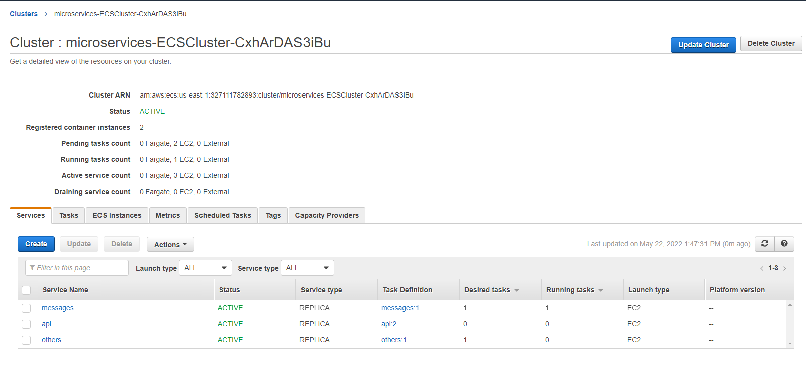
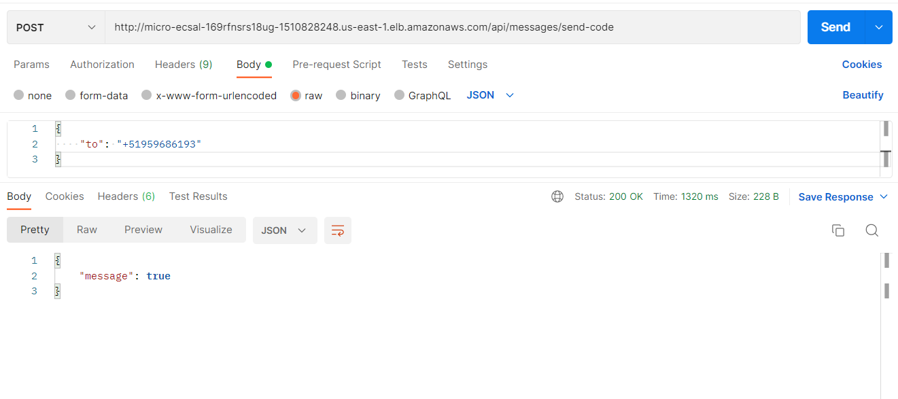
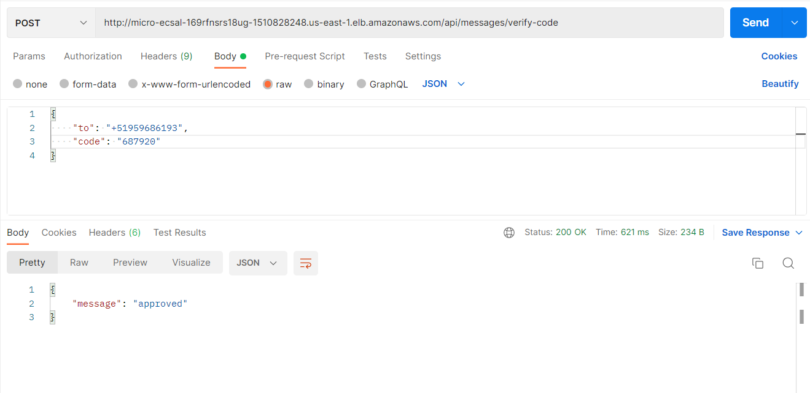
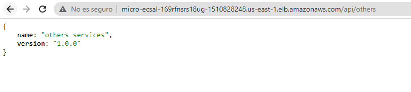

# Migración de una aplicación Monolitica a Microservicios

Caso aplicado: Microservicio para enviar y validar códigos de verificación.

### Servidor hecho en Node.js
Este es un ejemplo de un servicio node.js monolítico básico que ha sido diseñado para ejecutarse directamente en un servidor, sin un contenedor.

### Arquitectura

Dado que los programas de Node.js ejecutan un bucle de eventos de un solo subproceso, es necesario utilizar la funcionalidad de `clúster` del nodo para obtener el máximo uso de un servidor multinúcleo.

En este ejemplo, se utiliza un `clúster` para generar un proceso de trabajo por núcleo, y los procesos comparten un único puerto mediante el equilibrio de carga por turnos integrado en Node.js

Podemos usar un Balanceador de carga de aplicaciones para realizar solicitudes de operación por turnos en varios servidores, lo que proporciona una escalabilidad horizontal.

## Incluir el monolito en contenedores

En este ejemplo, tomamos nuestra aplicación de nodejs y la colocamos en un contenedor para su implementación en EC2 Container Service.


### Paso 1: Exploración
En la carpeta de proyecto con la ruta : _1-services_, debe ver las carpetas para infraestructura y servicios. La infraestructura posee el código de configuración de la infraestructura AWS CloudFormation que utilizará en el siguiente paso. Servicios contiene el código que forma la aplicación de node.js.

### Paso 2: Cree el repositorio:

Desplácese hasta la consola de Amazon ECR.
En la página Repositorios, seleccione Crear repositorio.
En la página Crear repositorio, introduzca el siguiente nombre para su repositorio: api.



### Paso 3: Crear y enviar la imagen Docker :


## Implementación del monolito
En este ejemplo, tomamos nuestra aplicación de nodo y la colocamos en un contenedor para su implementación en EC2 Container Service.



### ¿Por qué contenedores?

__Control de dependencia__: los contenedores envuelven el código de la aplicación en una unidad de implementación que captura una instantánea del código y sus dependencias, lo que resuelve algunos problemas:

- Es posible que la versión de `nodo` en la máquina de un desarrollador local no coincida con la versión en los servidores de producción o la versión en el servidor de CI, lo que permite a los desarrolladores enviar código que se ejecuta localmente pero falla en producción. Por otro lado, un contenedor se enviará con una versión específica de nodo incluida.
- Si las dependencias de `package.json` no se reducen rigurosamente, entonces `npm install` puede terminar instalando diferentes versiones de paquetes localmente, en un servidor CI y en los servidores de producción. Los contenedores resuelven esto al incluir todas las dependencias de npm con el código de la aplicación.

__Canalización mejorada__: el contenedor también permite que una organización de ingeniería cree una canalización estándar para el ciclo de vida de la aplicación. Por ejemplo:

- Los desarrolladores construyen y ejecutan el contenedor localmente.
- El servidor de CI ejecuta el mismo contenedor y ejecuta pruebas de integración para asegurarse de que supera las expectativas.
- El mismo contenedor se envía a un entorno de prueba donde se puede verificar su comportamiento en tiempo de ejecución mediante pruebas de carga o control de calidad manual.
- El mismo contenedor finalmente se envía a producción.

Ser capaz de enviar exactamente el mismo contenedor a través de las cuatro etapas del proceso hace que la entrega de una aplicación confiable y de alta calidad sea considerablemente más fácil.

__Sin mutaciones en las máquinas:__ Cuando las aplicaciones se implementan directamente en las instancias, corre el riesgo de que una mala implementación corrompa la configuración de una instancia de una manera que sea difícil de recuperar.

### ¿Por qué el servicio de contenedores EC2?

EC2 Container Service proporciona orquestación para sus contenedores. Automatiza el proceso de lanzamiento de contenedores en su flota de instancias de acuerdo con las reglas que especifique, luego automatiza el seguimiento de dónde se ejecutan esos contenedores para que pueda usar un balanceador de carga para enviar tráfico a ellos. También tiene funciones integradas para implementar implementaciones sin tiempo de inactividad, recopilar métricas y registros de sus contenedores y escalar automáticamente la cantidad de contenedores que está ejecutando en función de las métricas.

### Cambios en la aplicación para Docker

__Proceso único en lugar de `clúster`.__ El primer y mayor cambio relacionado con la creación de contenedores de esta aplicación es deshacerse del `clúster`. Con los contenedores docker, el objetivo es ejecutar un solo proceso por contenedor, en lugar de un grupo de procesos.

__Crear `Dockerfile`:__ Este archivo es básicamente un script de compilación que crea el contenedor. El contenedor base desde el que se inicia el dockerfile contiene una versión específica de node.js. Luego, el resto de los comandos agregan tanto el código de la aplicación como la carpeta `node_modules` al contenedor. El resultado es una imagen de contenedor que es una unidad de implementación confiable. El contenedor se puede ejecutar localmente o en un servidor remoto. Funcionará igual en ambos lugares.


_Fuente: AWS Labs._
### Paso 1: Lanzar un cluster de ECS mediante cloud formation

   ```
   $ aws cloudformation deployment \
   --template-file infrastructure/ecs.yml \
   --región <región> \
   --stack-name <nombre de la pila> \
   --capacidades CAPABILITY_NAMED_IAM
   ```


### Paso 2: Implemente los servicios en el clúster

   ```
   $ ./deploy.sh <región> <nombre de pila>
   ```





## Del monolito a los microservicios

En este ejemplo, tomamos nuestra aplicación monolítica implementada en ECS y la dividimos en microservicios.


### Paso 1: ¿Por qué microservicios?

__Aislamiento de fallas:__ Una buena arquitectura de microservicios significa que si una micropieza de su servicio falla, solo esa parte de su servicio fallará. El resto de su servicio puede continuar funcionando correctamente.

__Aislamiento por seguridad:__ Cuando se siguen las mejores prácticas de microservicios, el resultado es que si un atacante compromete un servicio, solo obtiene acceso a los recursos de ese servicio y no puede acceder horizontalmente a otros recursos de otros servicios sin entrar también en esos servicios.

__Escalado independiente:__ Cuando las características se dividen en microservicios, la cantidad de infraestructura y el número de instancias de cada clase de microservicio se pueden escalar hacia arriba y hacia abajo de forma independiente. 

__Velocidad de desarrollo__: los microservicios pueden permitir que un equipo construya más rápido al reducir el riesgo de desarrollo. En un monolito, agregar una nueva característica puede afectar potencialmente a todas las demás características que contiene el monolito. Los desarrolladores pueden estar seguros de que cualquier código que escriban en realidad no podrá afectar en absoluto al código existente, a menos que escriban explícitamente una conexión entre dos microservicios.

_Fuente: AWS Labs._

### Paso 2:  Cambios en la aplicación para microservicios


__Definir los límites de los microservicios:__ Definir los límites de los servicios es específico del diseño de su aplicación, pero para esta API REST, un enfoque bastante claro para dividirla es crear un servicio para cada una de las clases de objetos de nivel superior que sirve la API:

```
/api/messages/* -> Un servicio para todas las rutas REST relacionadas con el messages
/api/others/* -> Un servicio para todas las rutas REST relacionadas con others
```

Entonces, cada servicio solo servirá una clase particular de objeto REST, y nada más. Esto nos brindará algunas ventajas significativas en nuestra capacidad para monitorear y escalar de manera independiente cada servicio.

__Uniendo microservicios juntos:__ Una vez que hemos creado tres microservicios separados, necesitamos una forma de unir estos servicios separados nuevamente en una API que podamos exponer a los clientes. Aquí es donde entra en juego el balanceador de carga de aplicaciones de Amazon (ALB). Podemos crear reglas en el ALB que dirigen las solicitudes que coinciden con una ruta específica a un servicio específico. El ALB parece una API para los clientes y ni siquiera necesitan saber que hay múltiples microservicios trabajando juntos detrás de escena.

__Recortando lentamente:__ No siempre es posible desarmar por completo un servicio monolítico de una sola vez como lo es con este ejemplo simple. Si nuestro monolito era demasiado complicado para dividirlo todo a la vez, aún podemos usar ALB para redirigir solo un subconjunto del tráfico del servicio monolítico a un microservicio. El resto del tráfico continuaría hacia el monolito exactamente como antes.

Una vez que hayamos verificado que este nuevo microservicio funciona, podemos eliminar las rutas de código antiguas que ya no se ejecutan en el monolito. Cuando esté listo, repita el proceso dividiendo otra pequeña porción del código en un nuevo servicio. De esta manera, incluso los monolitos más complicados pueden romperse gradualmente de una manera segura que no pondrá en riesgo las características existentes.

### Paso 3: Despliegue

1. Inicie un clúster de ECS con la plantilla de Cloudformation ubicado en la ruta 2.microservices/infrastructure:

   ```
   $ aws cloudformation deployment \
   --template-file infrastructure/ecs.yml \
   --región <región> \
   --stack-name <nombre de la pila> \
   --capacidades CAPABILITY_NAMED_IAM
   ```

2. Implemente los servicios en su clúster:

   ```
   $ ./deploy.sh <región> <nombre de pila>



### Ahora si, A probar !

-  Microservicio que resuelve en la ruta : _/api/messages/_


<div align="center" style="margin-bottom:30px">
  
</div>


-  Microservicio que resuelve en la ruta : _/api/others/_ (<font size="1">Como plantilla para otros servicios</font>)




