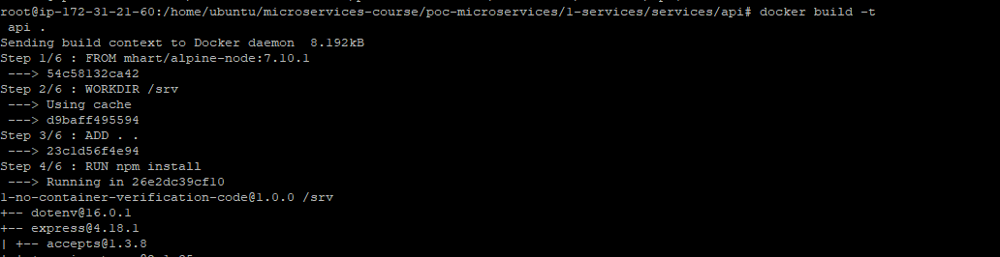

### Migración de una aplicación Monolitica a Microservicios

Microservicio para enviar y validar códigos de verificación.

## Servidor hecho en Node.js
Este es un ejemplo de un servicio node.js monolítico básico que ha sido diseñado para ejecutarse directamente en un servidor, sin un contenedor.

### Arquitectura

Dado que los programas de Node.js ejecutan un bucle de eventos de un solo subproceso, es necesario utilizar la funcionalidad de `clúster` del nodo para obtener el máximo uso de un servidor multinúcleo.

En este ejemplo, se utiliza un `clúster` para generar un proceso de trabajo por núcleo, y los procesos comparten un único puerto mediante el equilibrio de carga por turnos integrado en Node.js

Podemos usar un Balanceador de carga de aplicaciones para realizar solicitudes de operación por turnos en varios servidores, lo que proporciona una escalabilidad horizontal.

## Incluir el monolito en contenedores

En este ejemplo, tomamos nuestra aplicación de nodejs y la colocamos en un contenedor para su implementación en EC2 Container Service.

### Paso 1: Exploración
En la carpeta de proyecto con la ruta : _1-services_, debe ver las carpetas para infraestructura y servicios. La infraestructura posee el código de configuración de la infraestructura AWS CloudFormation que utilizará en el siguiente paso. Servicios contiene el código que forma la aplicación de node.js.

### Paso 2: Cree el repositorio:

Desplácese hasta la consola de Amazon ECR.
En la página Repositorios, seleccione Crear repositorio.
En la página Crear repositorio, introduzca el siguiente nombre para su repositorio: api.


### Paso 3: Crear y enviar la imagen Docker :



## Despliegue

1. Inicie un clúster de ECS con la plantilla de Cloudformation:

   ```
   $ aws cloudformation deployment \
   --template-file infraestructura/ecs.yml \
   --región <región> \
   --stack-name <nombre de la pila> \
   --capacidades CAPABILITY_NAMED_IAM
   ```

2. Implemente los servicios en su clúster:

   ```
   $ ./deploy.sh <región> <nombre de pila>
   ```

## Del monolito a los microservicios

En este ejemplo, tomamos nuestra aplicación monolítica implementada en ECS y la dividimos en microservicios.


## ¿Por qué microservicios?

__Aislamiento de fallas:__ Incluso las mejores organizaciones de ingeniería pueden tener y tienen fallas fatales en la producción. Además de seguir todas las prácticas recomendadas estándar para gestionar correctamente los bloqueos, un enfoque que puede limitar el impacto de dichos bloqueos es la creación de microservicios. Una buena arquitectura de microservicios significa que si una micropieza de su servicio falla, solo esa parte de su servicio fallará. El resto de su servicio puede continuar funcionando correctamente.

__Aislamiento por seguridad:__ En una aplicación monolítica, si una función de la aplicación tiene una brecha de seguridad, por ejemplo, una vulnerabilidad que permite la ejecución remota de código, entonces debe asumir que un atacante también podría haber obtenido acceso a todas las demás funciones del sistema. Esto puede ser peligroso si, por ejemplo, su función de carga de avatar tiene un problema de seguridad que termina comprometiendo su base de datos con contraseñas de usuario. La separación de sus funciones en microservicios mediante EC2 Container Service le permite bloquear el acceso a los recursos de AWS otorgando a cada servicio su propia función de IAM. Cuando se siguen las mejores prácticas de microservicios, el resultado es que si un atacante compromete un servicio, solo obtiene acceso a los recursos de ese servicio y no puede acceder horizontalmente a otros recursos de otros servicios sin entrar también en esos servicios.

__Escalado independiente:__ Cuando las características se dividen en microservicios, la cantidad de infraestructura y el número de instancias de cada clase de microservicio se pueden escalar hacia arriba y hacia abajo de forma independiente. Esto hace que sea más fácil medir el costo de la infraestructura de una función en particular, identificar las funciones que pueden necesitar optimizarse primero, así como mantener el rendimiento confiable para otras funciones si una función en particular está fuera de control sobre sus necesidades de recursos.

__Velocidad de desarrollo__: los microservicios pueden permitir que un equipo construya más rápido al reducir el riesgo de desarrollo. En un monolito, agregar una nueva característica puede afectar potencialmente a todas las demás características que contiene el monolito. Los desarrolladores deben considerar cuidadosamente el impacto de cualquier código que agreguen y asegurarse de no romper nada. Por otro lado, una arquitectura de microservicio adecuada tiene un nuevo código para una nueva función que se incluye en un nuevo servicio. Los desarrolladores pueden estar seguros de que cualquier código que escriban en realidad no podrá afectar en absoluto al código existente, a menos que escriban explícitamente una conexión entre dos microservicios.

## Cambios en la aplicación para microservicios

__Definir los límites de los microservicios:__ Definir los límites de los servicios es específico del diseño de su aplicación, pero para esta API REST, un enfoque bastante claro para dividirla es crear un servicio para cada una de las clases de objetos de nivel superior que sirve la API:

```
/api/users/* -> Un servicio para todas las rutas REST relacionadas con el usuario
/api/posts/* -> Un servicio para todas las rutas REST relacionadas con publicaciones
/api/threads/* -> Un servicio para todas las rutas REST relacionadas con subprocesos
```

Entonces, cada servicio solo servirá una clase particular de objeto REST, y nada más. Esto nos brindará algunas ventajas significativas en nuestra capacidad para monitorear y escalar de manera independiente cada servicio.

__Uniendo microservicios juntos:__ Una vez que hemos creado tres microservicios separados, necesitamos una forma de unir estos servicios separados nuevamente en una API que podamos exponer a los clientes. Aquí es donde entra en juego el balanceador de carga de aplicaciones de Amazon (ALB). Podemos crear reglas en el ALB que dirigen las solicitudes que coinciden con una ruta específica a un servicio específico. El ALB parece una API para los clientes y ni siquiera necesitan saber que hay múltiples microservicios trabajando juntos detrás de escena.

__Recortando lentamente:__ No siempre es posible desarmar por completo un servicio monolítico de una sola vez como lo es con este ejemplo simple. Si nuestro monolito era demasiado complicado para dividirlo todo a la vez, aún podemos usar ALB para redirigir solo un subconjunto del tráfico del servicio monolítico a un microservicio. El resto del tráfico continuaría hacia el monolito exactamente como antes.

Una vez que hayamos verificado que este nuevo microservicio funciona, podemos eliminar las rutas de código antiguas que ya no se ejecutan en el monolito. Cuando esté listo, repita el proceso dividiendo otra pequeña porción del código en un nuevo servicio. De esta manera, incluso los monolitos más complicados pueden romperse gradualmente de una manera segura que no pondrá en riesgo las características existentes.

## Despliegue

1. Inicie un clúster de ECS con la plantilla de Cloudformation:

   ```
   $ aws cloudformation deployment \
   --template-file infraestructura/ecs.yml \
   --región <región> \
   --stack-name <nombre de la pila> \
   --capacidades CAPABILITY_NAMED_IAM
   ```

2. Implemente los servicios en su clúster:

   ```
   $ ./deploy.sh <región> <nombre de pila>


